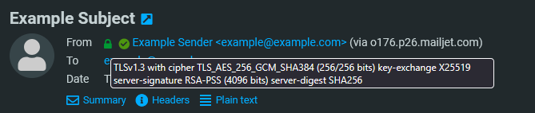
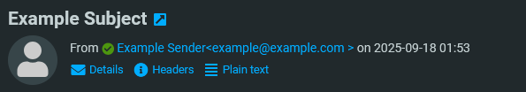

# Roundcube TLS Icon

Displays a small icon in the sender field that displays the (presumed) encryption state of received mails and displays the hostname of the last mailserver.

This plugin parses the "Received" header for the last hop and checks if TLS was used. This requires TLS logging in the
receiving MTA.

In Postfix this can be enabled by
setting [`smtpd_tls_received_header = yes`](https://www.postfix.org/postconf.5.html#smtpd_tls_received_header). Sendmail and Stalwart
should work out of the box. Other MTAs have not been explicitly tested.

Note that while this talks about "encryption", this does not imply security. An encrypted mail may still be insecure,
mostly because mailservers generally use  "opportunistic TLS", where MITM attacks are possible.
This also only validates the last hop of an email - some emails may run through multiple hops and we don't know anything
about the security of these.

Inspired by [roundcube-easy-unsubscribe](https://github.com/SS88UK/roundcube-easy-unsubscribe)

Forked from https://github.com/GermanCoding/Roundcube_TLS_Icon

### Example screenshot
`authres_status` was also installed for this screenshot

### Details mode

### Summary mode

### Changes compared to GermanCoding/Roundcube_TLS_Icon

- Dropped support for Roundcube 1.5 or older, including support for PHP 5.4-7.2 to align with https://github.com/roundcube/roundcubemail/wiki/Version-History
- Changed location of the padlock to the from field, to align with the `authres_status` plugin (and how it is displayed in Rainloop Webmail)
- Added support for showing localhost emails (when received using STARTTLS) as local instead of unencrypted
- Shows yellow broken padlock on TLS 1.0, TLS 1.1 and 'bad' implementations of TLS 1.2 and TLS 1.3
- Shows hostname of the last mailserver at the end of the sender line

## Installation

The [composer library](https://packagist.org/packages/christiaangoossens/tls_icon) name is: `christiaangoossens/tls_icon`.

The plugin name to add to your config file is: `tls_icon`.

## Requirements

- Roundcube `1.6.0` or newer.
- PHP `7.3` or newer.

## Currently supported languages

- Dutch
- English
- French
- German
- Russian
